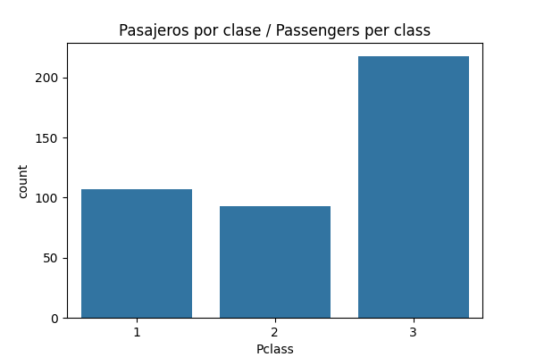
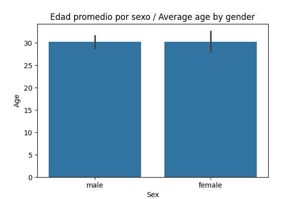
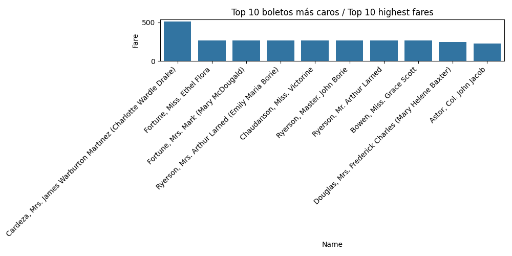

# Titanic Data Engineering Project / Proyecto de Ingeniería de Datos – Titanic 📘

## Overview / Descripción
This project demonstrates a complete data engineering workflow using the Titanic dataset.  
Este proyecto muestra un flujo completo de ingeniería de datos usando el dataset del Titanic.

**Goal / Objetivo:**  
Clean, transform, load, and analyze data to generate meaningful insights.  
Limpiar, transformar, cargar y analizar datos para generar insights significativos.

---

## 🧩 Technologies Used / Tecnologías Utilizadas
- **Database / Base de Datos:** PostgreSQL  
- **Python Libraries / Librerías Python:** pandas, numpy, matplotlib, seaborn, psycopg2  
- **Environment / Entorno de Trabajo:** Jupyter Notebook  
- **Dataset:** `test.csv` (raw) → `test_clean.csv` (cleaned)

---

## ⚙️ Project Workflow / Flujo del Proyecto

### 1️⃣ Data Cleaning / Limpieza de Datos
- Handle missing values / Llenado de valores faltantes  
- Standardize text / Estandarización de texto  
- Export clean CSV / Exportar CSV limpio  

### 2️⃣ Database Integration / Integración con Base de Datos
- Connect Python to PostgreSQL / Conectar Python a PostgreSQL  
- Create table with PRIMARY KEY / Crear tabla con PRIMARY KEY  
- Insert data using psycopg2 / Insertar datos usando psycopg2  

### 3️⃣ SQL Queries & Insights / Consultas SQL e Insights
- Count passengers per class / Contar pasajeros por clase  
- Average age by gender / Edad promedio por género  
- Top 10 highest fares / Top 10 boletos más caros  

### 4️⃣ Visualizations / Visualizaciones
- Generate graphs with matplotlib & seaborn / Generar gráficos con matplotlib y seaborn  
- Save graphs as PNG / Guardar gráficos como PNG  

---

## 📊 Key Insights / Insights Principales
- Most passengers traveled in third class, reflecting a predominance of lower-income individuals.  
  La mayoría de los pasajeros viajaban en tercera clase, reflejando predominancia de personas de menores ingresos.

- The average age of female passengers was slightly higher than that of male passengers.  
  La edad promedio de las mujeres fue ligeramente mayor que la de los hombres.

- The most expensive tickets belonged to first-class passengers, highlighting strong social and economic divisions.  
  Los boletos más caros pertenecían a pasajeros de primera clase, mostrando claras diferencias sociales y económicas.

---

## 📈 Visualizations / Visualizaciones

### Passengers per class / Pasajeros por clase

### Average age by gender / Edad promedio por género

### Top 10 highest fares / Top 10 boletos más caros

*(Include PNG screenshots in a folder called `/Images` for better presentation / Incluir capturas PNG en la carpeta `/Images` para mejor presentación)*

---

## 🧠 Key Learnings / Conocimientos Adquiridos
- Connecting Python with PostgreSQL / Conexión entre Python y PostgreSQL  
- Inserting data from pandas into SQL / Inserción de datos desde pandas a SQL  
- Running SQL queries directly from Python / Ejecución de consultas SQL desde Python  
- Visualizing SQL results / Visualización de resultados  
- Structuring and documenting a professional data project / Estructuración y documentación profesional de un proyecto de datos

---

## 👨‍💻 Author / Autor
**Matías Kostiak – Data Engineer**  
📍 Ciudad del Este, Paraguay  
📧 Contact: [matiaskostiak25@gmail.com](mailto:matiaskostiak25@gmail.com)
